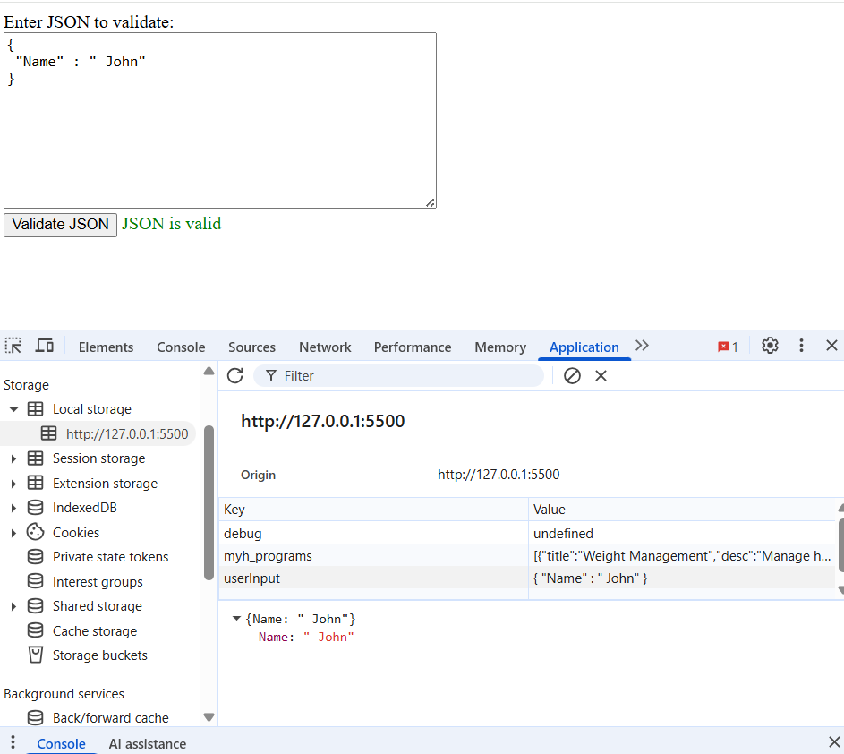
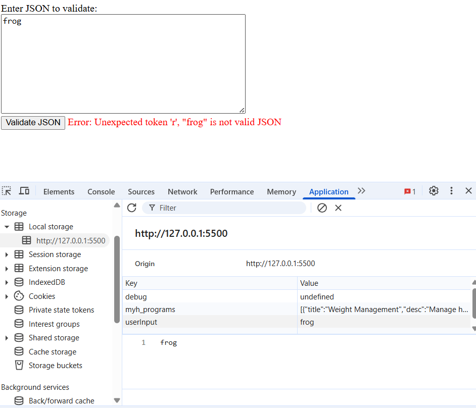

 


<h1 align="center">🧩 JSON Validator with Local Storage</h1>

In today’s modern web landscape, data validation and persistence are crucial components of user-centric design.  
This project provides a **simple, efficient, and educational JSON Validator** that allows users to input and validate JSON data while automatically saving their work through the **localStorage API**.  

By combining **JavaScript error handling**, **DOM manipulation**, and **browser-based storage**, this project highlights core front-end development skills that are essential for every web developer.

---

## 🧭 Table of Contents

- [🧭 Table of Contents](#-table-of-contents)
- [🧑‍💻 User Story](#-user-story)
- [✅ Acceptance Criteria](#-acceptance-criteria)
- [🧰 Technologies Used](#-technologies-used)
- [🚀 Live Demo](#-live-demo)
- [🖼️ Screenshots](#️-screenshots)
  - [✅ Valid JSON Example](#-valid-json-example)
  - [❌ Invalid JSON Example](#-invalid-json-example)
- [🧠 Overview](#-overview)
- [⚙️ How It Works](#️-how-it-works)
- [💡 Code Highlights](#-code-highlights)
- [Clone this repository:](#clone-this-repository)
- [Navigate into the project directory:](#navigate-into-the-project-directory)

---

## 🧑‍💻 User Story

AS A web developer or learner working with JSON data
I WANT a simple tool to validate and persist my JSON input
SO THAT I can test JSON structures and retain my progress across sessions


---

## ✅ Acceptance Criteria


GIVEN I have JSON data to test
WHEN I input the data into the validator
THEN I can click a button to validate its format
WHEN the JSON is valid
THEN I receive a success message in green
WHEN the JSON is invalid
THEN I receive an error message in red with details
WHEN I reload the page
THEN my previous input remains saved in localStorage


---

## 🧰 Technologies Used

- **HTML5** — Structure and layout  
- **CSS3** — Styling for a clean interface  
- **JavaScript (ES6)** — Core validation logic and localStorage handling  
- **localStorage API** — Client-side persistence of user data  

---

## 🚀 Live Demo

🔗 **[Try the JSON Validator on GitHub Pages](https://brxwnsugxr.github.io/JSON-validation-with-localstorage/)**  

---

## 🖼️ Screenshots

### ✅ Valid JSON Example
Displays a success message in green when valid JSON is detected.  


### ❌ Invalid JSON Example
Displays an error message in red with the specific parsing issue.  


---

## 🧠 Overview

This project demonstrates:
- JSON validation using the built-in `JSON.parse()` method.  
- Real-time feedback for valid or invalid user input.  
- Persistent user data storage using **localStorage**.  
- Graceful error handling and minimal UI design with **vanilla JavaScript**.  

---

## ⚙️ How It Works

1. The user enters JSON data into a textarea.  
2. Clicking **Validate JSON** runs a validation check using `JSON.parse()`.  
3. If valid, a green success message appears.  
4. If invalid, a red error message displays the issue.  
5. The JSON text is automatically saved in **localStorage**.  
6. On reload, the previously entered JSON reappears.  

---

## 💡 Code Highlights

```js
try {
  JSON.parse(jsonTextareaText);
  messageSpan.textContent = "✅ JSON is valid";
  messageSpan.className = "valid";
} catch (error) {
  messageSpan.textContent = `❌ Error: ${error.message}`;
  messageSpan.className = "invalid";
}
```

## Clone this repository:

git clone https://github.com/brxwnsugxr/JSON-validation-with-localstorage.git


## Navigate into the project directory:

cd JSON-validation-with-localstorage


Open index.html in your browser — no build tools required.